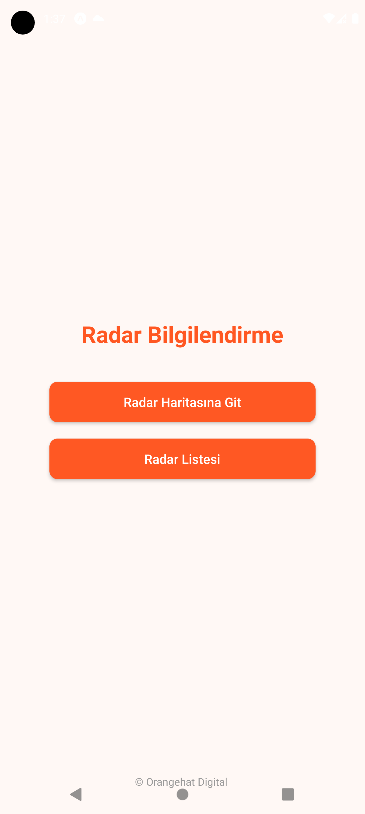
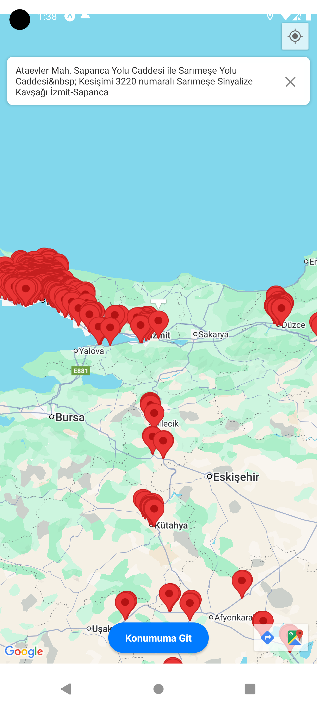
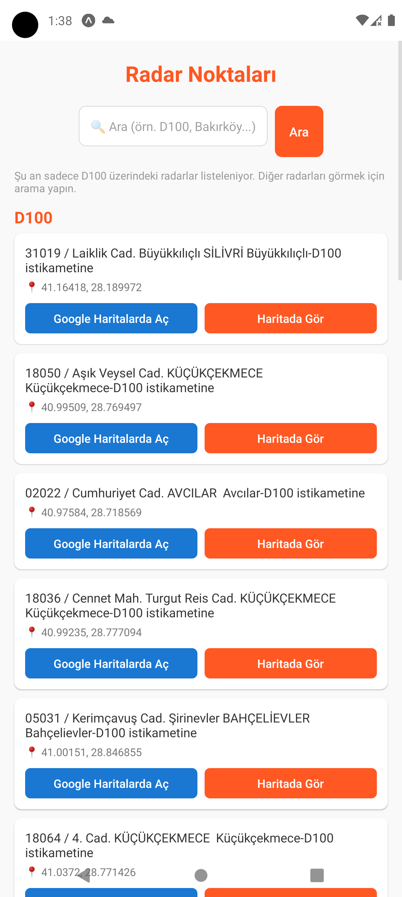

# 📡 Radar Bilgilendirme Uygulaması

Türkiye genelinde son dönemde aktif hale gelen radar noktalarını listeleyen ve bu radarları harita üzerinde görsel olarak sunan mobil bilgilendirme uygulamasıdır.

Uygulama, kullanıcı dostu arayüzü ve gerçek zamanlı konum bazlı navigasyon desteği ile, sürücülere trafikte daha bilinçli hareket etme imkanı sunar.

---

## 🚀 Özellikler

- Güncel radar noktalarının listelenmesi (özellikle D100 hattı baz alınmıştır)
- Harita entegrasyonu ile radar noktalarının konum bazlı gösterimi
- Detaylı adres bilgileri ve Google Haritalar yönlendirmesi
- Anlık konum ile etkileşim
- Basit ve hızlı kullanıcı deneyimi

---

## 🛠️ Kullanılan Teknolojiler

- **React Native**: Mobil uygulama geliştirme
- **React Native Maps & Google Maps SDK**: Harita ve lokasyon gösterimi
- **Expo**: Geliştirme ve önizleme kolaylığı

## 📸 Ekran Görüntüleri

| Ana Ekran | Harita Görünümü | Radar Listesi |
|:--:|:--:|:--:|
|  |  |  |
